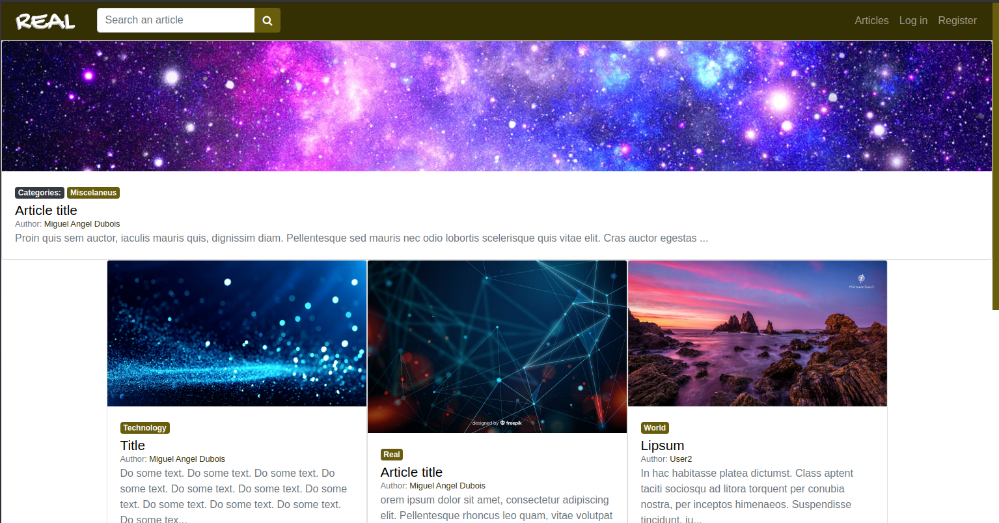
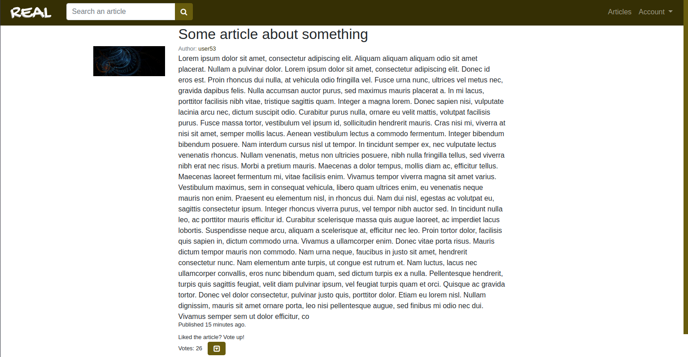
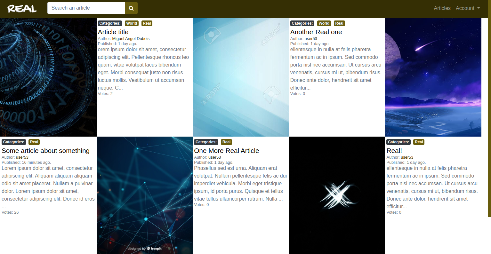
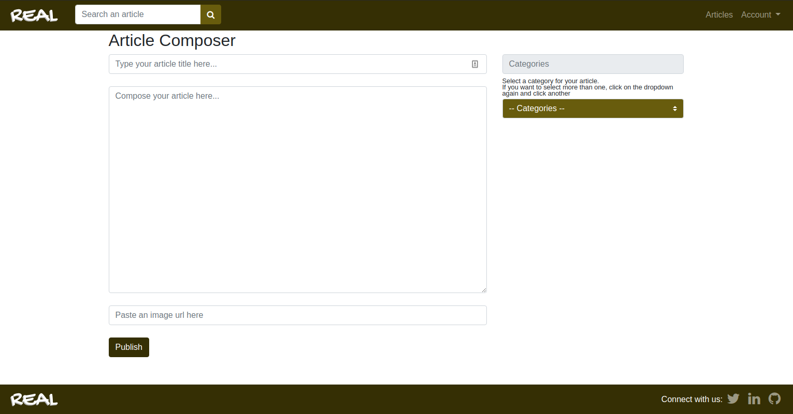

# Real Articles

This project was done with education purposes only, to demonstrate what I have learnt over the last weeks using ruby on rails.

## Built With

- Ruby 2.7.0
- Ruby on Rails 6.0.3

## How to deploy

To deploy the project on your local machine, follow these steps:

- First, create the database using rails db:create
```
$ rails db:create 
```
- Finally, migrate the database using rails db:migrate
```
$ rails db:migrate 
```
- To seed the database with the necessary categories on the category table, there's some records already created, so run the seed file by running the command rails db:seed. If the app is in the development environment, it also seed mock users, articles and votes.
```
$ rails db:seed 
```
- Finally, run the server on your local computer, and the application is ready to run.
```
$ rails server
```

## Author

👤 **Miguel Dubois**

- Github: [@MiguelDP4](https://github.com/MiguelDP4)
- Twitter: [@Mike_DP4](https://twitter.com/Mike_DP4)
- LinkedIn [Miguel Dubois](https://www.linkedin.com/in/miguel-angel-dubois)

## Live Demo

You can check a demo version of the project in [this link](https://real-articles-demo.herokuapp.com/).

### Demo images

#### Home Page



#### Article Page



#### Search article by category page



#### Create New Article Page



## 🤝 Contributing

This project is for learning purposes only, I wont accept contributions, though suggestions are welcome.

## Show your support

Give a ⭐️ if you like this project!

## Acknowledgments

- I thank microverse for this learning opportunity.